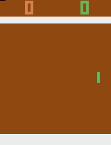

# Atari Pong - Double Deep Q-Learning with Fixed Q-Targets and Prioritized Experience Replay

<p align="center">
    
</p>

## Overview
[Double Deep Q-Learning](https://arxiv.org/pdf/1509.06461.pdf) extends the Deep Q-Learning with Fixed Q-Targets approach, taking advantage of a policy and target neural network to prevent the network chasing it's own tail (risky analogy). They differ in that DDQN uses the policy network to find the `a'` in the `max(Q(s',a'))` term in the bellman optimality equation, while the `Q(s',a')` is still calculated by the target network.

For more information regarding the Fixed Q-Targets method, see the cartpole [README](https://github.com/davidmkwon/rl/tree/vm/src/cartpole/dqn2).

Rather than using the traditional approach to experience replay by storing experiences in a replay buffer (array) with each experience an equal chance to be selected, we use [Prioritized Experience Replay](https://arxiv.org/pdf/1511.05952.pdf). In brief, PER stores experiences in the buffer with a priority (we use a binary sum tree as the backing data structure) that is based on the TD error between optimal q value and the estimated q value--this means that experiences that have "the most to learn from" are more likely to be selected when sampling a batch from the buffer. You will also notice in `main.py` that we **fill up the entire replay buffer before starting training**. This is caused by the nature of the sumtree structure that required us to have a filled buffer.

Unlike Cartpole, where the state's could be simplified to 4 observation measurements, with Atari games like Pong we use the entire image as the state input. Because the original state of the RGB image is unecessary, we preprocess the image by cutting out the top and bottom segments as well as converting to grayscale. We then **frame stack** four frames (see ``frstack.py``) to convey a sense of motion to the neural network. This gives a final state input dimension of [4,84,84].

The architecture for the policy and target networks consist of 2 convolutional layers, followed by two fully connected layers 
(see `ddqn.py`). We use pytorch's `nn.Conv2d` to shape the convolutional layers and `nn.Linear` for the fully connected layers. We use the relu activation function.

Run:
```bash
python main.py
python test.py
```

## Hyperparameters:
- ALPHA = 0.00025
- GAMMA = 0.99
- NUM EPISODES = 1200
- EPSILON DECAY = 0.00005
- MEMORY SIZE = 100000
- BATCH SIZE = 32
- TAU = 10000


## Performance
I unfortunately did not update the rewards graph iteratively throughought the training process, rather saving it to be done at the end at once. Thus there is no chart (as of now).

The network began to converge at around episode 500-600, with an average reward score of 19.5 out of the maximum 21. The network reached a highest average score of 20.8. When testing the network (using only the policy net), the network consistenly reached a perfect score of 21 / 21.

## Libraries
- `torch`
- `numpy`
- `gym`
- `skimage`
- `matplotlib`