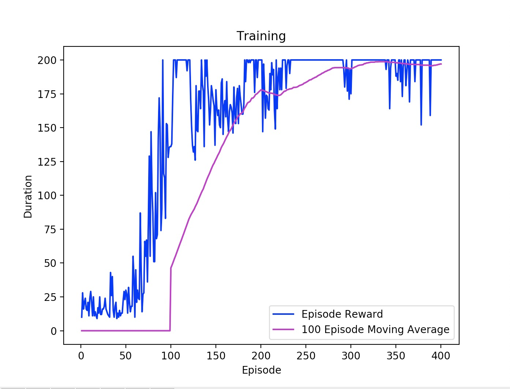
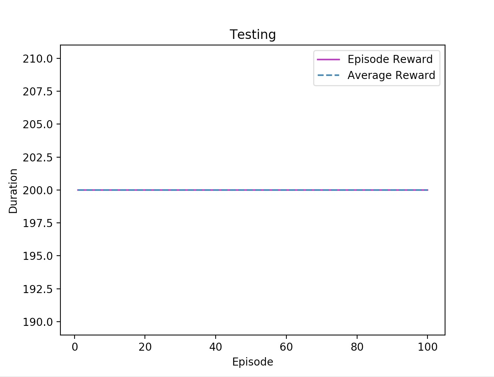

# Cartpole - Deep Q-learning with Fixed Q-Targets (2)

## Overview
A deep q-learning with fixed q-targets approach to solving OpenAI Gym's Cartpole environment. We use a neural net of 3 layers--an input layer taking 4 inputs corresponding to observations from the environment (cart position, cart velocity, pole angle, pole velocity), a hidden layer with 24 nodes, and an output layer with 2 outputs corresponding to the potential actions.

In the training process, we use two models, `policy_net` and `target_net`. `policy_net` is used by the agent for selecting the optimal action (highest q-value output from network), while `target_net` is used to calculate the optimal q-value using the Bellman Optimality equation. `target_net` then copies `policy_net`'s parameters every TARGET_UPDATE = 10 episodes.

Experience replay is used to train the model faster and to prevent it from learning in a sequential manner. The `ReplayBuffer` class is a wrapper for a list of size MEMORY_SIZE = 100000 that stores experiences in (state, action, next_state, reward, done) format. We randomly sample BATCH_SIZE = 32 experiences from the buffer to feed `policy_net`.

We use PyTorch for construction of the model--`nn.Linear` for the neural net layers, `F.relu` for Rectified Linear Unit activation function, and `optim.Adam` for Adam optimizer.

Run:
```bash
python main.py
python test.py
```

## Hyperparameters
- ALPHA = 0.001
- GAMMA = 0.99
- NUM EPISODES = 400
- EPSILON DECAY = 0.001
- BATCH SIZE = 32
- MEMORY SIZE = 100000
- TARGET UPDATE = 10

## Performance
During the training process, although it is initially a little stagnant, the model begins to rapidly improve around the 60th episode. Around the 200th episode the model already begins to reach MAX_STEPS = 200 with ease, and the occasional drops in performance are likely caused by the exploration tradeoff in the greedy epsilon strategy.



During the testing process, the model performs exceptionally well, reaching MAX_STEPS = 200 every single episode. The drops in performance we saw in the training phase no longer impact performance as the epsilon value is set to 0, and the agent always uses `policy_net` to determine its actions.



## Libararies
- `gym`
- `torch`
- `numpy`
- `matplotlib`