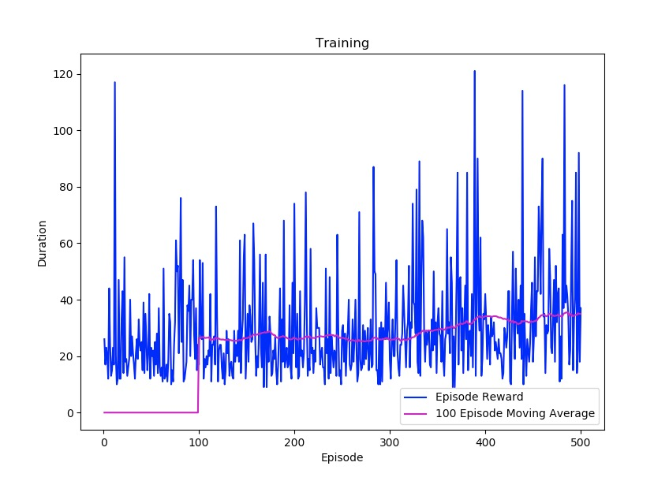
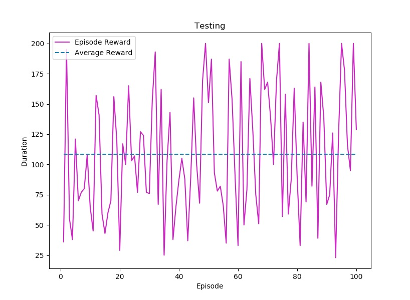

# Cartpole - Vanilla Q-Learning

## Overview
A standard q-learning approach to solving OpenAI Gym's Cartpole environment. Because there are infinite potential states, we convert cart position, cart velocity, pole angle, and pole velocity measurements into a 4 digit number through discretized buckets (see `env.py` for exact sizes). We then map these 4 digit numbers to the two potential actions (left or right) in the q-table.

Currently, testing and training reside in different python files, so `pickle` is used for storing the q_table dictionary externally.

Looking at the performance graphs, the agent performs significantly better during testing as expected (epsilon is set to 0, so the agent always exploits). Interestingly, when the agent is trained for longer periods (~1000-1500 episodes) it will occasionally peform worse when testing. This could be due to the nature of using a q-table in this environment—the longer the agent is trained, the larger the q-table becomes, and the more likely untrained paths are taken. This is however all speculation.

Run:
```bash
python train.py
python test.py
```

## Hyperparameters
- ALPHA = 0.1
- GAMMA = 0.9
- NUM_EPISODES = 500
- EPSILON DECAY = 0.001

## Performance
During the training process, the agent experiences a very gradual increase in performance, and often stagnant at times. This is likely due to the simply vast number of potential combinations of buckets (technically 10^4 possibilities). To improve, the agent would either need to be trained for a considerably longer time, or find a more efficient bucket structure. The exploration tradeoff in the epsilon greedy strategy also likely contributes a deal to the agent's performance.



During the testing process, the agent performs in a rather random manner, with an almost consistent deviation of 50 rewards from the ~110 average. This is likely caused by the incompleteness of the q-table (not sufficiently large enough to capture majority of potential experiences). Note however that the agent still performs significantly better than in the training process, as it's epsilon is now 0.



## Libraries
- `pickle`
- `matplotlib`
- `pandas`
- `numpy`
- `gym`